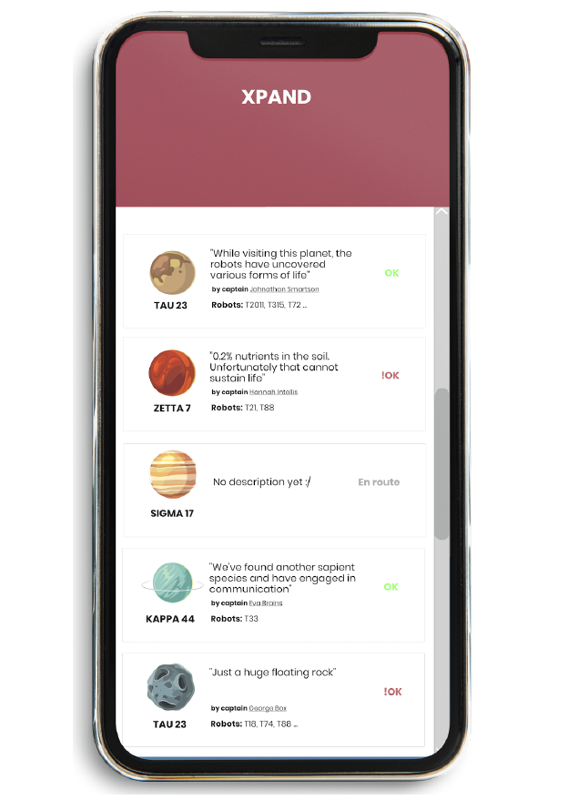

## ExploringPlanets App

<h2 style="color: blue"></h2>

Thanks to the efforts put forth by brave explorers, we live in an era where the human
race will become a multi-planet species. One of the challenges for doing this is keeping
track of the status of each expedition that traverses multiple unknown solar systems in
order to find life.
We plan to create an application that models the expedition process so that we can
keep track of the planets that were visited, and the status of each of these planets.
Each planet in the solar system is visited by a team of explorers composed of one
human captain and multiple robots that board a shuttle and navigate the solar system
for finding planets that can sustain life. When reaching a planet, the robots can
determine whether it is suitable for human life or not. The human captain can use the
application in order to communicate the status of the expedition to the other exploring
teams, so that they do not visit the same planet again.

<h2 style="color: blue">The UI</h2>

The user interface for the application should be a web based, single page application
that runs on phone resolution, written in whatever is most convenient ( Angular , React ,
Vue or without any frameworks, and should look something like):

<ol>The application practically allows the user to do two things:
	<li>Allows the user to see all the planets existent in the solar system, in order to see
their statuses (UX close to what is shown in the mockups)</li>
<li>Allows the captain to change the status and description of a planet (this is up to
you to figure out how exactly)</li>
</ol>

<ul>
A planet is represented in the system by the following aspects:
<li>The planet has a name</li>
<li>The planet has an image</li>
<li>The planet has a description that is filled out by the captain of the team</li>
<li>The planet has a status: OK, !OK, TODO, En route</li>
<li>The planet has a number of robots that are exploring it</li>
</ul>

<ul>
The tasks that are part of this UI challenge are:
<li>Start an application from scratch in a chosen technology</li>
<li>Implement a way of retrieving the planet data from the API</li>
<li>Implement the UI screen as shown in the mockup</li>
<li>Implement a way in which the user of the app can update the properties of the
planet</li>
</ul>

<h2>The API</h2>

The backend system (or API) should be structured according to a microservice
architecture composed of two web services (one for planets, one for crews) written in
the .NET Core 3.Keep in mind that we want to make life as easy as possible for the UI
developers .
The protocol for communicating between webservices i n the API l ayer can be either
REST , GraphQL , gRPC or any websocket driven implementation.
For persistence, any solution (SQL or NoSQL) is acceptable (some suggestions here are
SQLServer , MySQL , Redis etc)

<ul>
At a conceptual level we know that:
<li>We have planets (:O)</li>
<li>Planets can have statuses and descriptions added by captains of teams</li>
<li>Teams contain a human captain and multiple robots</li>
</ul>

<ul>
The tasks that are part of this API challenge are:
<li>Start an application from scratch in the mentioned technology</li>
<li>Design de model for the mentioned problem</li>
<li>Choose a storage solution that can handle persistence of the model</li>
<li>Implement a means to expose the model to the UI using a chosen protocol</li>
<li>Implement a means to communicate between the microservices</li>
<li>Ensure that the entities are validated, as not to allow the backend to get
into an unstable state</li>
<li>Use a means of authenticating users into the system</li>
</ul>

I'm still working on the front end. So far only the authentication part as well as the interceptor to make authorized requests are implemented ... :)

